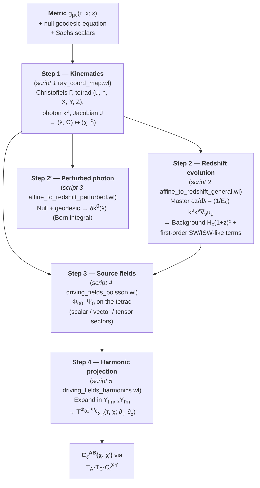

# Pipeline overview — from the null geodesic to observable power spectra

The five scripts in `scripts/` implement a single, linear derivation chain.
Starting from only the Poisson-gauge perturbed FLRW metric and two
universal first principles (the null geodesic equation and Sachs' optical
equations), they deliver the per-multipole transfer operators that map
scalar and tensor metric perturbations onto the angular power spectra of
the bilocal lensing observables $\Phi_{00}$ and $\Psi_0$.

This document walks the full chain so the individual script docs can
focus on mechanics. A reader who understands this page can open any one
of the five `.wl` files and know exactly where in the derivation they
are.

## 1. What we want

For a bilocal lensing analysis the observables are the two **Sachs optical
scalars** along a past-directed null congruence:

$$
\boxed{\;\Phi_{00} \;=\; \tfrac{1}{2}\,R_{\mu\nu}\,k^\mu k^\nu\;}\qquad
\boxed{\;\Psi_0 \;=\; -\,R_{abcd}\,k^a Z^b k^c Z^d\;}
$$

- $\Phi_{00}$ is the **Ricci focusing scalar**: the trace part of the
  tidal tensor projected on the photon, driving beam convergence.
- $\Psi_0$ is the **Weyl shear scalar**: the spin-2 projection onto a
  complex null screen vector $Z = (X + iY)/\sqrt 2$ where $\{X, Y\}$
  span the instantaneous screen plane.

We want these fields as *linear operators* acting on the underlying
scalar/tensor metric perturbations, each mode at a time. That is the
output of the pipeline.

## 2. What we assume (first principles)

Two inputs and nothing else:

1. **General relativity.** The photon worldline is an affinely
   parameterised null geodesic,
   $$k^\mu\nabla_\mu k^\nu = 0,\qquad g_{\mu\nu}k^\mu k^\nu = 0.$$
2. **Poisson gauge on FLRW** with a small-amplitude bookkeeper $\varepsilon$,
   $$
   \mathrm{d}s^2 = a^2(\tau)\bigl[-(1+2\varepsilon\Psi)\mathrm{d}\tau^2
     -2\varepsilon(\partial_i B)\mathrm{d}\tau\mathrm{d}x^i
     +((1-2\varepsilon\Phi)\delta_{ij}+\varepsilon h_{ij})\mathrm{d}x^i\mathrm{d}x^j\bigr].
   $$

Everything else — the tetrad, the photon energy evolution, the harmonic
projection — is *derived* mechanically.

## 3. The chain

Mermaid source

### Step 1 — Kinematics (script 1, `ray_coord_map.wl`)

Given the metric, build the symbolic objects every later script will
need:

- **Inverse metric and Christoffels**, linearised in $\varepsilon$.
- **Orthonormal tetrad** along a user-specified sky direction
  $\hat{\Omega}(\theta,\phi)$:
  $$u^\mu = (a^{-1}(1+2\varepsilon\Psi)^{-1/2},\,\mathbf 0),\qquad
    n^\mu = a^{-1}\bigl(-\varepsilon B_{\cdot i}\hat\Omega^i,\,\hat\Omega^i + \varepsilon(\Phi\hat\Omega^i - \tfrac{1}{2}h^i_j\hat\Omega^j)\bigr).$$
- **Null 4-momentum** $k^\mu = E(-u^\mu + n^\mu)$, past-directed.
- **Background Jacobian** of the coordinate map
  $(\lambda,\Omega)\to(\chi,\hat n)$:
  $\det J_{(0)} = E/a$, strictly positive ⇒ invertible.
- **Chain-rule identity** $\mathrm d\chi/\mathrm dz = 1/H_c(z)$ both in
  conformal-Hubble and cosmic-Hubble form.
- **First-order null-geodesic RHS** $-\Gamma^\mu_{(1)\,\nu\rho}k^\nu_{(0)}k^\rho_{(0)}$
  emitted as the symbolic line-of-sight integrand for $\delta\chi$ and
  $\delta\hat n$.

### Step 2 — Redshift evolution (script 2, `affine_to_redshift_general.wl`)

The observer's redshift is defined from the photon's local energy
$E=u_\mu k^\mu$, so $(1+z) = E/E_0$ and

$$
\frac{\mathrm{d}E}{\mathrm{d}\lambda}
= k^\mu k^\nu \nabla_\nu u_\mu,\qquad
\frac{\mathrm{d}z}{\mathrm{d}\lambda} = \frac{1}{E_0}\,k^\mu k^\nu \nabla_\nu u_\mu.
$$

Plugging the tetrad and Christoffels from step 1 into the covariant
derivative and linearising in $\varepsilon$ gives two pieces:

- **Background:** $\left(\mathrm d z/\mathrm d\lambda\right)_{(0)} = E_0\,H_c(z)(1+z)^2$.
- **First-order Born correction:** the SW/ISW-like combination of
  $\partial_\tau\Psi$, $\partial_\tau\Phi$, $n^i\partial_i\Psi$, $\dot h_{ij}$, etc.

A **cosmic-time cross-check** (Phase 8 of the script) re-does the
background piece with $g_{\mu\nu} = \mathrm{diag}(-1, a^2, a^2, a^2)$ and
confirms the conformal/cosmic identification $\mathcal H = a\,H$.

### Step 2′ — Perturbed photon (script 3, `affine_to_redshift_perturbed.wl`)

Where script 2 keeps $k^\mu$ at zeroth order (Born), script 3 integrates
the full first-order geodesic for $\delta k^\mu$. The two first
principles used here are:

- **Null condition at $\mathcal O(\varepsilon)$** — one algebraic
  equation, solved for $\delta k^3$ in terms of $\delta k^0$ and the
  metric perturbations.
- **Geodesic equation for $k^0$ at $\mathcal O(\varepsilon)$** — a
  first-order ODE whose integrand is printed as
  `%%TEX_RHS_full%%`, then decomposed into scalar/vector/tensor
  sectors.

The closed-form scalar integrand (Phase 9) is the Born-limit source for
$\delta k^0$ in conformal time and is the stepping stone to any future
beyond-Born extension.

### Step 3 — Source fields (script 4, `driving_fields_poisson.wl`)

With the tetrad, $k^\mu$, the Christoffels, and the Riemann tensor in
hand, the two Sachs scalars are evaluated by *direct contraction*:

$$
\Phi_{00}^{(1)} = \tfrac{1}{2}R_{\mu\nu}^{(1)}\,k^\mu_{(0)}k^\nu_{(0)}
+ R_{\mu\nu}^{(0)}\,k^\mu_{(0)}\delta k^\nu + \dots
$$

$$
\Psi_0^{(1)} = -R^{(1)}_{abcd}\,k^a_{(0)}Z^b_{(0)}k^c_{(0)}Z^d_{(0)} + \dots
$$

The FLRW background is conformally flat, so $\Psi_0^{(0)}=0$ (no shear
without perturbations). The Ricci focusing scalar however does not
vanish: Einstein's equations give $\Phi_{00}^{(0)} = 4\pi G(\rho+p)\,E^2$,
equivalent to $(a^2/E^2)\Phi_{00}^{(0)} = \mathcal H^2 - \mathcal H'$.
The average background matter and pressure focus the null congruence,
and the `%%BG_PHI00%%` block of script 04 prints this exactly.
The linear piece is **decomposed by sector**:

- `{SCALAR_*_LIN}` — set $B = h_{ij} = 0$, keep $\{\Psi,\Phi\}$.
- `{TENSOR_*_LIN}` — set $\Psi = \Phi = B = 0$, keep $h_{ij}$;
  then apply the TT gauge $h^i_i = 0$, $\partial^i h_{ij} = 0$.
- `{B_*_LIN}` — isolate the shift sector $B$.

Phase 13 is a **rigor check** that later papers usually gloss over:

- **Test (a)**: rotate the screen plane by an arbitrary field $\omega(\tau,x)$;
  the residual $\Psi_0^{(1)} - \Psi_0^{(1),\mathrm{rotated}}$ vanishes
  identically. *Conclusion: any two first-order orthonormal screen bases
  give the same $\Psi_0^{(1)}$; parallel-transported tetrad ≡ locally
  orthonormal tetrad at this order.*
- **Test (b)**: use the background screen basis (which is *not* first-order
  orthonormal in the perturbed metric). The residual is nonzero —
  confirming that test (a)'s invariance is not a triviality but a
  consequence of proper normalisation.
- **Test (c)**: replacing $k^\mu$ by $k^\mu_{(0)}$ in $\Phi_{00}$ changes
  the answer (unlike $\Psi_0$), because the FLRW background Ricci is
  nonzero while the background Weyl vanishes. This is why script 4
  retains $k^\mu$ at first order inside $\Phi_{00}$.

### Step 4 — Harmonic projection (script 5, `driving_fields_harmonics.wl`)

On the past light cone the spatial coordinate factorises as
$x^i = \chi\,\hat n^i$. Spatial derivatives split into a radial part and
an angular part:

$$
\partial_i = \hat n_i\,\partial_\chi + \tfrac{1}{\chi}\,\nabla_i^{(S)},
$$

and on multipole amplitudes $f_{\ell m}(\tau,\chi)$ the angular
operators reduce to eigenvalue form:

$$
\nabla^2 f_{\ell m} = \bigl[\partial_\chi^2 + \tfrac{2}{\chi}\partial_\chi - \tfrac{L_2}{\chi^2}\bigr]f_{\ell m},\qquad
L_2 := \ell(\ell+1).
$$

The complex screen gradient $m^i\partial_i = (1/\chi)\,\eth$ acts as a
spin-raising operator (Goldberg et al.). Applying $\eth$ twice to a
scalar multipole gives the coefficient of ${}_2Y_{\ell m}$ via

$$
\eth^2 Y_{\ell m} = \sqrt{L_2(L_2-2)}\;{}_2Y_{\ell m}.
$$

With these operator identities the script reads off the per-$\ell$
**transfer operators** from the real-space forms of $\Phi_{00}$ and
$\Psi_0$:

$$
\Phi_{00,\ell m}(\tau,\chi) = \sum_{X\in\{\Psi,\Phi,B,h^{(0)}\}} T^{\Phi_{00}}_{X,\ell}(\tau,\chi;\partial_\tau,\partial_\chi)\,X_{\ell m},
$$

$$
\Psi_{0,\ell m}(\tau,\chi) = \sum_{X\in\{\Psi,\Phi,B,h^{(0)},h^{(1)},h^{(2)}\}} T^{\Psi_0}_{X,\ell}(\tau,\chi;\partial_\tau,\partial_\chi)\,X_{\ell m}.
$$

`opMatrix` extracts each $T$ as a six-element vector of coefficients in
the derivative basis
$\{X_{\ell m},\partial_\chi X_{\ell m},\partial_\chi^2 X_{\ell m},\partial_\tau X_{\ell m},\partial_\tau^2 X_{\ell m},\partial_\tau\partial_\chi X_{\ell m}\}$.
These are the numbers serialised to
`driving_fields_harmonics.m` and consumed by the Python package.

## 4. From transfer operators to power spectra

The observable angular power spectra factorise:

$$
C_\ell^{\mathcal A\mathcal B}(\chi,\chi')
 = \sum_{X,Y}\,T^{\mathcal A}_{X,\ell}(\tau,\chi;\partial_\tau,\partial_\chi)\,
              T^{\mathcal B}_{Y,\ell}(\tau',\chi';\partial_{\tau'},\partial_{\chi'})\;
              C_\ell^{XY}(\chi,\chi'),
$$

evaluated on the light cone $\tau = \tau_0 - \chi$. That is all the
numerical pipeline has to do at run-time.

## 5. Why we trust the answer

| Check | Where | Confirms |
|-------|-------|----------|
| Tetrad orthonormality to $\mathcal O(\varepsilon)$ | every script, after building $u,n,X,Y,Z$ | Correct tetrad, correct projections |
| $k\cdot k = 0$, $u\cdot k = E$ | every script | Null photon, local-energy bookkeeping |
| Cosmic-time cross-check | `affine_to_redshift_general.wl` Phase 8 | Conformal vs. cosmic Hubble consistency |
| Rotation invariance of $\Psi_0^{(1)}$ | `driving_fields_poisson.wl` Phase 13 (a) | Tetrad-convention independence |
| BG-basis negative control | `driving_fields_poisson.wl` Phase 13 (b) | Test (a) relies on genuine first-order normalisation |
| Flat- vs. full-triad factor | `driving_fields_poisson.wl` Phase 14 | The paper's $E^2/(4a^2)$ prefactor is self-consistent |
| Spin-raising eigenvalue | `driving_fields_harmonics.wl` + `/tmp/verify_spin_raise.wl` | $\eth^2 Y_{\ell m} = \sqrt{L_2(L_2-2)}\,{}_2Y_{\ell m}$ numerically verified |
| CI regression | `stf-transfer` tests | Python pipeline stays in lockstep with the `.m` dump |

## 6. Reading order

1. This page.
2. [`01_ray_coord_map.md`](./01_ray_coord_map.md) — kinematic foundation.
3. [`02_affine_to_redshift_general.md`](./02_affine_to_redshift_general.md) — $\mathrm dz/\mathrm d\lambda$ at Born level.
4. [`03_affine_to_redshift_perturbed.md`](./03_affine_to_redshift_perturbed.md) — $\delta k^\mu$ beyond Born.
5. [`04_driving_fields_poisson.md`](./04_driving_fields_poisson.md) — Sachs fields in real space.
6. [`05_driving_fields_harmonics.md`](./05_driving_fields_harmonics.md) — transfer operators per $\ell$.
