# 01 — `ray_coord_map.wl`

> Kinematic foundation: given the Poisson-gauge metric, build the tetrad,
> the photon 4-momentum, the background coordinate-map Jacobian, and the
> first-order null-geodesic source integrands that every later script
> will reuse.

## 1. Purpose and paper anchor

Script entry point: [`scripts/ray_coord_map.wl`](../ray_coord_map.wl)
(320 lines). Paper anchor: `sections/code_availability.tex` L11–L18 and
`sections/cosmology.tex`'s subsection *"From Ray Tracing to Cosmological
Coordinates"*.

The script derives, symbolically and in one go, the five ingredients the
paper calls "the kinematic part of the coordinate map":

1. the background radial rate $\mathrm d\chi/\mathrm d\lambda$,
2. the $3\times 3$ Jacobian $J_{(0)}$ and its determinant,
3. the chain rule $\mathrm d\chi/\mathrm dz = 1/H_c$,
4. the first-order null-geodesic right-hand side driving $\delta\chi$
   and $\delta\hat n$,
5. its scalar-sector decomposition (time component, radial projection,
   transverse projection).

Every LaTeX block between `%%TEX_..._START%%` / `..._END%%` pastes
directly into the corresponding paper equation
(see §6 below for the marker ↔ equation table).

## 2. First principles

Three standard GR results drive the entire script:

$$
g_{\mu\nu}k^\mu k^\nu = 0 \quad\text{(null condition)},\qquad
k^\mu\nabla_\mu k^\nu = 0 \quad\text{(null geodesic)},\qquad
E = u_\mu k^\mu \quad\text{(local photon energy)}.
$$

Plus two elementary geometric identities:

- On the past light cone of a flat FLRW observer the conformal radius
  and the conformal time are related by $\chi = \tau_0 - \tau$, hence
  $\mathrm d\chi/\mathrm d\lambda = -k^0$.
- Because $1+z = 1/a$ at background, $\mathrm dz/\mathrm d\tau = -a'/a^2 = -\mathcal H/a$.

Everything else is derived.

## 3. Pre-assumptions and conventions

| Assumption | Value / form |
|---|---|
| Gauge | Poisson (scalar shift as gradient, $h_{ij}$ transverse-traceless when restricted) |
| Coordinates | $\{\tau, x^1, x^2, x^3\}$, conformal time, Cartesian spatial |
| Signature | $(-,+,+,+)$ |
| Perturbation order | linear in `eps` — enforced by `linearize` after each build |
| Ray direction | parametrised by $\hat\Omega(\theta,\phi)$ on $S^2$ (spans the full sky) |
| Observer | Hubble-flow, $u^\mu = (1/(a\sqrt{1+2\varepsilon\Psi}),\mathbf 0)$ |
| Photon energy | $E$ kept as a free symbol; $E = E_0/a$ **not** imposed (background-only relation) |
| Past-directedness | $k^\mu = E(-u^\mu + n^\mu)$, so $k^0 < 0$ in the ray's interior |

## 4. Logical derivation chain

### Step A — Build the perturbed metric and its Christoffels

Writing `eps` as the formal order-counter,

$$
g_{\mu\nu} = g^{(0)}_{\mu\nu} + \varepsilon\,\delta g_{\mu\nu},\qquad
g^{\mu\nu} = g^{(0)\,\mu\nu} - \varepsilon\,g^{(0)\,\mu\alpha}\,\delta g_{\alpha\beta}\,g^{(0)\,\beta\nu} + \mathcal O(\varepsilon^2),
$$

$$
\Gamma^\alpha_{\mu\nu} = \tfrac{1}{2}g^{\alpha\beta}\bigl(\partial_\mu g_{\beta\nu} + \partial_\nu g_{\beta\mu} - \partial_\beta g_{\mu\nu}\bigr),
$$

both linearised by `Normal@Series[·, {eps,0,1}]`.

**Pre-assumption used:** small perturbations, so $\mathcal O(\varepsilon^2)$
can be discarded after each non-linear step.

**What it produces:** `Gam[α,μ,ν]` and `gMinv[μ,ν]` at $\mathcal O(\varepsilon)$.

### Step B — Build the tetrad along $\hat\Omega$

The Hubble observer is enforced orthonormal via
`u^μ = (1/(a√(1+2εΨ)), 0)`; the line-of-sight unit vector along an
arbitrary sky direction $\hat\Omega^i = (\sin\theta\cos\phi,\sin\theta\sin\phi,\cos\theta)$
is

$$
n^\mu \;=\; \Bigl(-\tfrac{\varepsilon}{a}\,\hat\Omega^i\partial_i B,\;\;
\tfrac{1}{a}\bigl[\hat\Omega^i + \varepsilon(\Phi\hat\Omega^i - \tfrac{1}{2}h^i{}_j\hat\Omega^j)\bigr]\Bigr).
$$

**First principles used:** $u\cdot u = -1$, $n\cdot n = +1$,
$u\cdot n = 0$ — each verified to $\mathcal O(\varepsilon)$ in-script
(see §7).

### Step C — Photon 4-momentum and null check

$k^\mu = E(-u^\mu + n^\mu)$ is past-directed (so $\mathrm d\tau/\mathrm d\lambda = k^0 < 0$),
and the script asserts the null condition $g_{\mu\nu}k^\mu k^\nu = 0$ to
$\mathcal O(\varepsilon)$.

### Step D — Background radial rate

On the past light cone $\chi = \tau_0 - \tau$, so
$\mathrm d\chi/\mathrm d\lambda = -k^0$. At background,
$k^0_{(0)} = -E/a$, giving

$$
\boxed{\;\;\left(\frac{\mathrm d\chi}{\mathrm d\lambda}\right)_{(0)} \;=\; \frac{E}{a} \;=\; \frac{E_0}{a^2}\;\;}\qquad\text{(past-directed, positive).}
$$

### Step E — Background Jacobian

At background the ray is straight ($\delta\hat n_{(0)} = 0$) and
$\chi$ depends only on $\lambda$:

$$
J_{(0)} = \frac{\partial(\chi,\hat n^A)}{\partial(\lambda,\Omega^B)}
= \mathrm{diag}\!\left(\tfrac{E}{a},\,1,\,1\right),\qquad
\det J_{(0)} = \tfrac{E}{a} > 0.
$$

Positivity ⇒ invertibility of the map $(\lambda,\Omega)\leftrightarrow(\chi,\hat n)$
in the weak-lensing regime.

### Step F — Chain rule $\mathrm d\chi/\mathrm dz_{(0)}$

Using the **background redshift** $z_{(0)}$ defined by $1 + z_{(0)} = 1/a$,
so $\mathrm dz_{(0)}/\mathrm d\tau = -\mathcal H\,(1+z_{(0)})$, and the substitution
rule `Derivative[1][a][tt] -> aa Hconf[tt]`:

$$
\left(\frac{\mathrm dz_{(0)}}{\mathrm d\lambda}\right)_{(0)} = \frac{E\,\mathcal H}{a^2} \;=\; E_0\,H_c(z_{(0)})\,(1+z_{(0)})^2,
\qquad
\left(\frac{\mathrm d\chi}{\mathrm dz_{(0)}}\right)_{(0)} = \frac{a}{\mathcal H} = \frac{1}{H_c(z_{(0)})}.
$$

(Conformal Hubble $\mathcal H \equiv a'/a$, cosmic Hubble $H_c \equiv \dot a/a$, so $\mathcal H = a\,H_c$.)

> **Discipline — background-only substitutions.** The relation $1 + z_{(0)} = 1/a$
> (equivalently $E_{\text{bg}} = E_0/a$) is **confined to this step**, which is
> Phase 8 of the script. It is:
>
> - *legal* here: Step F computes a purely background quantity, so substituting
>   $a = 1/(1+z_{(0)})$ is an identity, not an approximation.
> - *not reused* in Step G (Phase 9): the first-order null-geodesic RHS keeps
>   $E$ symbolic, never substitutes $a \to 1/(1+z_{(0)})$, and therefore the
>   angular-dependent `Sin[th]`, `Cos[th]` terms in `delta_k_RHS_Gam1` are free
>   of any hidden background identification.
>
> The full redshift along a perturbed ray is $z = z_{(0)} + \varepsilon\,z_{(1)}$;
> only the background piece $z_{(0)}$ is tied to $a$ by this algebraic identity.
> Any formula that mentions the full $z$ — e.g. the first-order Born correction
> to $\mathrm dz/\mathrm d\lambda$ in [script 2](./02_affine_to_redshift_general.md)
> — must not invoke $1 + z = 1/a$.

### Step G — First-order null-geodesic RHS

From $k^\mu\nabla_\mu k^\nu = 0$, expanded to $\mathcal O(\varepsilon)$:

$$
\frac{\mathrm d\,\delta k^\mu}{\mathrm d\lambda} \;=\; -\,\Gamma^{\mu\,(1)}_{\;\;\nu\rho}\,k^\nu_{(0)}k^\rho_{(0)}\;-\;2\,\Gamma^{\mu\,(0)}_{\;\;\nu\rho}\,k^\nu_{(0)}\,\delta k^\rho.
$$

The script emits the **first term** (the direct source from the
perturbed Christoffels) as `%%TEX_DELTA_K_RHS%%`; it is the line-of-sight
integrand driving $\delta\chi$ and $\delta\hat n$.

### Step H — Scalar-sector projections

Setting $B = 0$ and $h_{ij} = 0$ collapses the source to its scalar
content. Three projections are emitted:

- **Time component** (drives $\delta\tau$; reproduces the SW/ISW
  integrand),
- **Radial projection** $S^i\hat\Omega^i$ (drives the radial-rate correction),
- **Transverse projection** $S^i - (S\cdot\hat\Omega)\hat\Omega^i$ (drives the deflection).

The script cross-checks the transverse projection at the pole $\theta=0$
against the expected form $-(E^2/a^2)\partial_{e_A}(\Phi+\Psi)$.

## 5. Code map

| Phase | Lines | Action | Key primitives |
|-------|-------|--------|----------------|
| 1 | 40–54 | Coordinates, perturbation field symbols, `di[f,k]` | Lazy symbolic functions |
| 2 | 56–73 | Poisson-gauge metric, $g^{\mu\nu}$ at $\mathcal O(\varepsilon)$ | `Inverse`, `linearize` |
| — | 75–82 | Christoffels (manual index loop) | `Table`, `D` |
| 3 | 84–92 | Sky direction $\hat\Omega(\theta,\phi)$; $|\hat\Omega|^2 = 1$ | `FullSimplify` |
| 4 | 94–126 | Tetrad $(u^\mu, n^\mu)$; orthonormality checks | Manual contraction |
| 5 | 128–134 | Photon $k^\mu = E(-u^\mu + n^\mu)$; null check | — |
| 6 | 136–143 | Background $\mathrm d\chi/\mathrm d\lambda = E/a$ | — |
| 7 | 145–157 | Background Jacobian $J_{(0)}$ and $\det J_{(0)}$ | `Det` |
| 8 | 159–189 | Chain rule $\mathrm d\chi/\mathrm dz$ in both Hubble conventions | `HRules` |
| 9 | 191–226 | First-order null-geodesic RHS (source) | `Coefficient[Gam, eps, 1]` |
| 9b | 228–280 | Scalar-sector decomposition (time/radial/transverse) | Field-level `FuncName -> (0 &)` |
| 10 | 282–302 | Emit `%%TEX_*%%` blocks | `TeXForm` |
| 11 | 304–317 | Serialize all results to `ray_coord_map.m` | `Put` |

## 6. Inputs / outputs

**Inputs (symbolic):**

- Metric perturbation fields `PsiF[tt,x1,x2,x3]`, `PhiF[...]`, `BF[...]`, `hF11[...]`, …, `hF23[...]`.
- Scale factor `a[tt]`.
- Conformal/cosmic Hubble symbols `Hconf[tt]`, `Hcosm[tt]`, used only in
  the final rewrite.

**TeX output markers → paper equation:**

| Marker | Content | Paper label |
|---|---|---|
| `%%TEX_DCHIDLAM_BG%%` | $E/a$ | `eq: dchi dlambda bg` |
| `%%TEX_JBG%%` | $J_{(0)} = \mathrm{diag}(E/a,1,1)$ | `eq: jacobian bg` |
| `%%TEX_DETJBG%%` | $\det J_{(0)} = E/a$ | `eq: coord jacobian` |
| `%%TEX_DCHIDZ_BG%%` | $1/H_c(z)$ | `eq: chi of z` |
| `%%TEX_DZDLAM_BG%%` | $E_0 H_c (1+z)^2$ | `eq: dz dlambda bg` |
| `%%TEX_DELTA_K_RHS%%` | $-\Gamma^{\mu\,(1)}k_{(0)}k_{(0)}$ (vector) | footnote of "From Affine to Redshift" |
| `%%TEX_KSRC_TIME_SCALAR%%` | scalar-sector $S^0$ | radial/time panel of the Jacobian-block appendix |
| `%%TEX_KSRC_RAD_SCALAR%%` | scalar-sector $S^i\hat\Omega_i$ | — |
| `%%TEX_KSRC_TRANS_SCALAR%%` | scalar-sector transverse $S^i$ | — |

**Machine-readable output:** [`scripts/ray_coord_map.m`](../ray_coord_map.m)
stores `{dchi_dlambda_bg, det_JBg, JBg, dchi_dz_bg, dzdlamBg_z_only, delta_k_RHS_Gam1, kSrc_time_scalar, kSrc_radial_scalar, kSrc_trans_scalar_pole}`
as a Mathematica association; it is the regression fixture for the
Python `stf-transfer` pipeline.

## 7. Built-in verification

The script asserts, at $\mathcal O(\varepsilon)$:

- $|\hat\Omega|^2 = 1$ (Phase 3, L91).
- $u\cdot n = 0$, $n\cdot n = 1$ (Phase 4, L120–126).
- $k\cdot k = 0$ (Phase 5, L132–134).
- $\det J_{(0)} > 0$ (Phase 7, L156).
- Scalar-sector transverse source at the pole
  $=(-E^2/a^2)\partial_{e_A}(\Phi+\Psi)$ (Phase 9b, L272–274).

Each check prints a human-readable "[check] … (expected …)" line so a
run log is self-auditing.

## 8. How to reproduce

```bash
wolframscript -file scripts/ray_coord_map.wl
# or, via the skill wrapper:
~/.claude/skills/mathematica-xact-xpand/scripts/run-wl.sh \
    scripts/ray_coord_map.wl 300
```

Run time is a few seconds. Output prints `%%TEX_*%%` blocks; redirect
stdout if you want to paste them verbatim into LaTeX.

## 9. Upstream / downstream



<details><summary>Mermaid source</summary>

```mermaid
flowchart LR
  META[Poisson metric<br/>(§2 of paper)] --> RCM[ray_coord_map.wl]
  RCM --> DFP[driving_fields_poisson.wl]
  RCM --> ATRG[affine_to_redshift_general.wl]
  RCM --> DUMP[(ray_coord_map.m)]
  DUMP --> PY[stf-transfer / gevolution ingest]
```

</details>

- **Upstream:** only the Poisson-gauge FLRW metric definition.
- **Downstream (symbolic):** every other script in `scripts/` re-derives
  the tetrad and Christoffels using the *same* formulae, so any change
  here must be reflected in scripts 2–4.
- **Downstream (numerical):** the background quantities
  (`dchi_dlambda_bg`, `dzdlamBg_z_only`, `JBg`) pin the radial–redshift
  grid used by the Python pipeline.
