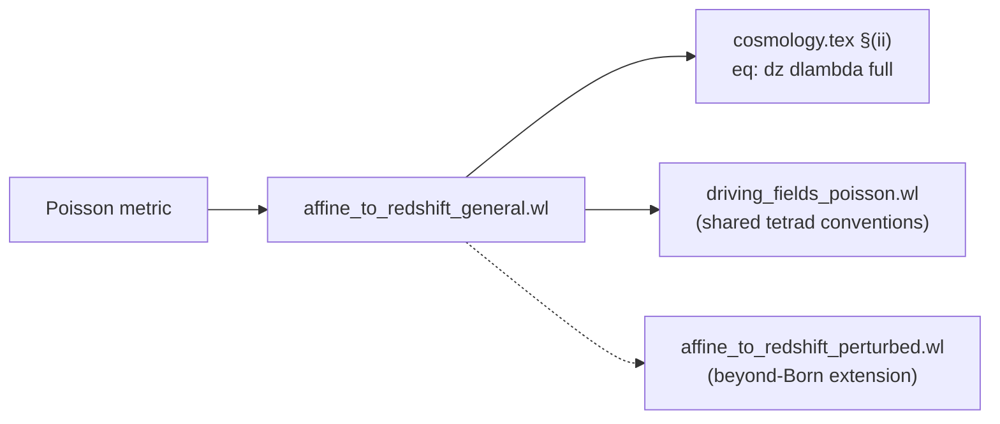

# 02 — `affine_to_redshift_general.wl`

> The master redshift-evolution formula
> $\mathrm dz/\mathrm d\lambda = (1/E_0)\,k^\mu k^\nu\nabla_\nu u_\mu$
> derived on the Poisson-gauge perturbed FLRW metric, split into
> background + first-order Born correction, and independently
> cross-checked in cosmic time.

## 1. Purpose and paper anchor

Script: [`scripts/affine_to_redshift_general.wl`](../affine_to_redshift_general.wl)
(226 lines). Paper anchor:
`sections/code_availability.tex` L19–L22 and the subsection
*"(ii) Observed redshift evolution"* of `sections/cosmology.tex`.

Produces `eq: dz dlambda full`: the full first-order Born expression for
$\mathrm dz/\mathrm d\lambda$ along the past light cone, together with
its background limit.

## 2. First principles

> **A note on "Born".** In what follows, "Born" is the cosmology-lensing
> convention (Bartelmann & Schneider 2001): first-order sources evaluated
> along the background ray. It is first order in $\varepsilon$, not zeroth.
> The qualifier picks a specific *ray* (the background one) along which
> the sources are contracted, as opposed to the self-consistently perturbed
> ray computed in [script 03](./03_affine_to_redshift_perturbed.md).

- **Observer redshift from local energy.** The photon's energy as
  measured by a comoving observer is
  $E(\lambda) = u_\mu(\lambda)\,k^\mu(\lambda)$, so
  $(1+z) = E(\lambda)/E_0$ with $E_0 = E(\lambda = 0)$ the
  constant observer-today energy.
- **Gradient of $E$ along the ray.** Using the geodesic equation
  $k^\mu\nabla_\mu k^\nu = 0$ and the product rule,
  $$
  \frac{\mathrm dE}{\mathrm d\lambda} = k^\mu\nabla_\mu(u_\nu k^\nu)
  = k^\mu k^\nu\nabla_\mu u_\nu \;+\; u_\nu\underbrace{k^\mu\nabla_\mu k^\nu}_{=0}
  = k^\mu k^\nu\nabla_\mu u_\nu.
  $$
  (Symmetry in $\mu\leftrightarrow\nu$ lets us write $\nabla_\nu u_\mu$.)
- **Linearisation.** Keep $\mathcal O(\varepsilon^1)$ and drop
  $\mathcal O(\varepsilon^2)$ after each non-linear manipulation.
- **Born level.** $k^\mu = E(-u^\mu + n^\mu)$ is built from
  first-order-corrected $u^\mu$ and $n^\mu$ at the spacetime point,
  with $n^\mu$ the *Born-level local tetrad leg* (orthonormalised
  against the perturbed metric at that point). No self-consistent
  propagation correction $\delta k^\mu$ is added here; the non-local
  aberration piece it encodes is treated separately in
  [`03_affine_to_redshift_perturbed.md`](./03_affine_to_redshift_perturbed.md).

## 3. Pre-assumptions and conventions

| Assumption | Value |
|---|---|
| Metric | Poisson gauge (see `README.md` §"Shared conventions") |
| Signature | $(-,+,+,+)$ |
| Observer | Hubble-flow, $u^\mu = (a^{-1}(1+2\varepsilon\Psi)^{-1/2},\mathbf 0)$ |
| Photon | past-directed along $+x^3$: $k^\mu = E\,(-u^\mu + n^\mu)$, with $n^\mu$ the third spatial tetrad leg |
| Energy bookkeeping | $E$ kept symbolic; $E = E_0/a$ is **not** substituted (only a *background* relation) |
| Treatment of $k$ | Born: $k^\mu = E(-u^\mu + n^\mu)$ built with first-order-corrected $u^\mu, n^\mu$ at the spacetime point; no self-consistent propagation correction $\delta k^\mu$ (deferred to script 03) |

## 4. Logical derivation chain

### Step A — Build Christoffels from the metric

Same construction as script 1 (`ray_coord_map.wl`), lines 63–92:
build $g^{\mu\nu}$ from `g0M - g0Minv · δg · g0Minv`, then
$\Gamma^\alpha_{\mu\nu}$, both linearised in $\varepsilon$.

### Step B — Observer 4-velocity at $\mathcal O(\varepsilon)$

$$
u^\mu = \frac{1}{a\sqrt{1+2\varepsilon\Psi}}\,\delta^\mu_0,\qquad
u_\mu = g_{\mu\nu}u^\nu,
$$

both expanded to first order. The script checks
$g_{\mu\nu}u^\mu u^\nu = -1$ explicitly.

### Step C — Line-of-sight tetrad $n^\mu$ along $+x^3$

A fixed direction along $+x^3$ is used here (unlike the arbitrary
$\hat\Omega$ in script 1). The construction

$$
n^\mu = \Bigl(-\tfrac{\varepsilon}{a}\partial_3 B,\;\tfrac{1}{a}(\delta^i{}_3 + \varepsilon[\Phi\delta^i{}_3 - \tfrac{1}{2}h^i{}_3])\Bigr)
$$

is orthonormal to $\mathcal O(\varepsilon)$; the script asserts
$u\cdot n = 0$, $n\cdot n = 1$. This is a *Born-level local tetrad
leg*: its first-order corrections are the purely local pieces needed
to make orthonormality hold against the perturbed metric at the
spacetime point. It is **not** the physical $n^\mu(\lambda)$ that a
past Hubble observer would perceive along the ray — that object
differs by the non-local aberration piece carried by $\delta k^\mu$,
which is treated in script 03.

### Step D — Photon and sanity checks

Past-directed photon $k^\mu = E(-u^\mu + n^\mu)$ satisfies
$k\cdot k = 0$ and $u_\mu k^\mu = E$ (the local energy), both verified
in-script.

### Step E — Compute $\mathrm dE/\mathrm d\lambda$

$$
\nabla_\nu u_\mu = \partial_\nu u_\mu - \Gamma^\lambda_{\nu\mu}\,u_\lambda,
$$

then contract with $k^\mu k^\nu$ and linearise:

$$
\frac{\mathrm dE}{\mathrm d\lambda} = k^\mu k^\nu\bigl(\partial_\nu u_\mu - \Gamma^\lambda_{\nu\mu}u_\lambda\bigr).
$$

The `eps^0` coefficient is the background rate; `Coefficient[·, eps, 1]`
gives the first-order piece. The substitution
`Derivative[1][a][tt] -> aa Hcf[tt]` rewrites $a'$ as $a\mathcal H$ for
readability.

### Step F — Background result

After linearisation,

$$
\left(\frac{\mathrm dE}{\mathrm d\lambda}\right)_{(0)} = -\frac{E^2\,\mathcal H(\tau)}{a^2},\qquad
\left(\frac{\mathrm dz}{\mathrm d\lambda}\right)_{(0)} = \frac{1}{E_0}\left(\frac{\mathrm dE}{\mathrm d\lambda}\right)_{(0)},
$$

which, using $E = E_0/a$ and $\mathcal H = a\,H_c$, reduces to the
standard $E_0\,H_c(z)(1+z)^2$.

### Step G — First-order Born correction

Coefficient of `eps` in `dEdlam`:

$$
\left(\frac{\mathrm dE}{\mathrm d\lambda}\right)_{(1)} \;=\; \text{(linear combination of }\Psi,\Phi,B,h_{ij}\text{ and their derivatives)}
$$

printed as `%%TEX_dEdlamPert%%` / `%%TEX_dzdlamPert%%`.

### Step H — Independent cosmic-time cross-check

Phase 8 (L186–214) rebuilds the calculation from scratch in the cosmic-time
metric $\mathrm ds^2 = -\mathrm dt^2 + a^2\delta_{ij}\mathrm dx^i\mathrm dx^j$:

- $u^\mu = (1,\mathbf 0)$, $u_\mu = (-1,\mathbf 0)$,
- $n^\mu = (0,0,0,1/a)$,
- $k^\mu = E(-u^\mu + n^\mu)$.

Substitutes `Derivative[1][a][tt] -> aa Hcosm[tt]` and prints the result,
which should be `EE^2 * Hcosm[tt]` — independent of $a$ in cosmic-time
coordinates. This confirms the identification $\mathcal H = a\,H_c$ and
gives a coordinate-independent sanity check on the whole Phase 7
computation.

### Step I — Archive

Phase 9 prints the final expressions in `InputForm` inside an
`%%INPUT_ARCHIVE%%` block so they can be re-ingested in a later session
without recomputing.

## 5. Code map

| Phase | Lines | Action |
|-------|-------|--------|
| 1 | 47–61 | Coordinates, perturbation field symbols |
| 2 | 63–74 | Poisson metric, `linearize` helper |
| 3 | 78–92 | Inverse metric, Christoffels |
| 4 | 94–103 | $u^\mu$, $u_\mu$, $u\cdot u = -1$ |
| 5 | 105–128 | Tetrad `nUp = tet[3]`, $u\cdot n = 0$, $n\cdot n = 1$ |
| 6 | 130–146 | $k^\mu$, $k\cdot k = 0$, $u\cdot k = E$ |
| 7 | 148–184 | Compute and linearise $k^\mu k^\nu\nabla_\nu u_\mu$; emit `%%TEX_dEdlam*%%`, `%%TEX_dzdlam*%%` |
| 8 | 186–214 | Cosmic-time cross-check (rebuild everything with diagonal metric) |
| 9 | 216–223 | `%%INPUT_ARCHIVE%%` dump of all four expressions |

## 6. Inputs / outputs

**Inputs:** metric field symbols (`PsiF`, `PhiF`, `BF`, `hF11`, …, `hF23`),
scale factor `a[tt]`, optional Hubble symbol `Hcf[tt]`.

**TeX markers → paper equations:**

| Marker | Content | Paper label |
|---|---|---|
| `%%TEX_dEdlamBg%%` | $(-E^2\mathcal H/a^2)$ | intermediate, used in derivation |
| `%%TEX_dEdlamPert%%` | first-order $\mathrm dE/\mathrm d\lambda$ | intermediate |
| `%%TEX_dzdlamBg%%` | background $\mathrm dz/\mathrm d\lambda$ | `eq: dz dlambda bg` |
| `%%TEX_dzdlamPert%%` | first-order Born $\mathrm dz/\mathrm d\lambda$ | `eq: dz dlambda full` |

There is no `.m` file: the expressions are meant to be read off the
printed TeX blocks.

## 7. Built-in verification

| Check | Where | Expectation |
|---|---|---|
| $u\cdot u$ | L103 | $-1$ |
| $u\cdot n$ | L124 | $0$ (to $\mathcal O(\varepsilon)$) |
| $n\cdot n$ | L128 | $+1$ |
| $k\cdot k$ | L140 | $0$ |
| $u\cdot k$ | L145 | $+E$ (past-directed convention) |
| Cosmic-time $k\cdot k$ | L205 | $0$ |
| Cosmic-time $\mathrm dE/\mathrm d\lambda$ | L212 | $E^2\,H_c(\tau)$, *independent of $a$* |

## 8. How to reproduce

```bash
wolframscript -file scripts/affine_to_redshift_general.wl
```

Run time is a few seconds. All `%%TEX_*%%` blocks are printed to stdout.

## 9. Upstream / downstream



<details><summary>Mermaid source</summary>



</details>

- **Upstream:** shared Poisson-gauge metric (see `README.md`).
- **Downstream:** the tetrad / photon conventions are duplicated in
  `driving_fields_poisson.wl`; the first-order result is the direct
  source of the redshift-correction equation in the paper.
- **Related:** `affine_to_redshift_perturbed.wl` extends the calculation
  beyond Born level by computing $\delta k^\mu$ self-consistently.
