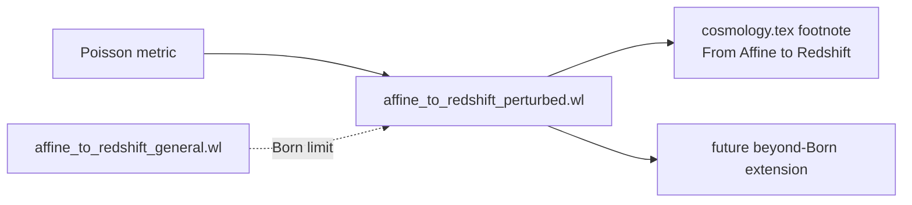

# 03 — `affine_to_redshift_perturbed.wl`

> The first-order correction $\delta k^\mu$ to the photon 4-momentum
> along a past-directed null geodesic, derived from two first
> principles — the null condition and the geodesic equation — both at
> $\mathcal O(\varepsilon)$. Decomposed into scalar, vector, and tensor
> sectors; the scalar-sector integrand is returned in closed form.

## 1. Purpose and paper anchor

Script: [`scripts/affine_to_redshift_perturbed.wl`](../affine_to_redshift_perturbed.wl)
(265 lines). Paper anchor:
`sections/code_availability.tex` L23–L27 and the footnote of the
subsection *"From Affine to Redshift"* of `sections/cosmology.tex`.

**Scope.** Script 2 (`affine_to_redshift_general.wl`) kept $k^\mu$ at
$\mathcal O(\varepsilon^0)$ — the Born approximation. Script 3 relaxes
that: it solves self-consistently for $\delta k^\mu$ along the ray by
integrating the first-order geodesic equation, yielding the material
needed for any beyond-Born extension of the paper. In the published
paper the result is cited but not retained (see the footnote).

## 2. First principles

> **A note on "beyond Born".** "Born" in the cosmology-lensing sense means
> first-order sources integrated along the background ray (this is
> [script 02](./02_affine_to_redshift_general.md)'s treatment). Script 03
> is "beyond Born" because it computes $\delta k^\mu$, the correction that
> deforms the ray itself at first order. Both calculations are first order
> in $\varepsilon$; the qualifier distinguishes *which ray* the sources
> live on.

Two equations, each expanded to $\mathcal O(\varepsilon)$:

- **Null condition** (algebraic):
  $$
  g_{\mu\nu}k^\mu k^\nu = 0
  \;\Longrightarrow\;
  2\,g_{\mu\nu}^{(0)}\,\bar k^\mu\delta k^\nu + g_{\mu\nu}^{(1)}\,\bar k^\mu\bar k^\nu = 0.
  $$
  Solving for $\delta k^3$ gives it in terms of $\delta k^0$ and the
  metric perturbations — one algebraic constraint, eliminating one
  unknown.
- **Geodesic equation** for the $\mu=0$ component (differential):
  $$
  k^\mu\nabla_\mu k^0 = 0
  \;\Longrightarrow\;
  \frac{\mathrm d\,\delta k^0}{\mathrm d\lambda}
  = -\,\Gamma^{0\,(1)}_{\;\;\mu\nu}\,\bar k^\mu\bar k^\nu
    -2\,\Gamma^{0\,(0)}_{\;\;\mu\nu}\,\bar k^\mu\,\delta k^\nu.
  $$
  A first-order ODE in $\delta k^0(\lambda)$; its integrand is the
  "RHS" that the script emits.

## 3. Pre-assumptions and conventions

| Assumption | Value |
|---|---|
| Metric | Poisson gauge (same as scripts 1, 2) |
| Background redshift | $1 + z_{(0)} \equiv 1/a(\tau)$ (background-only identity) |
| Background photon | $\bar k^\mu = (-E_0/a^2,\,0,\,0,\,+E_0/a^2)$, past-directed along $+x^3$ |
| Ansatz for $\delta k^\mu$ | $\delta k = (\delta k^0(\tau),\,0,\,0,\,\delta k^3(\tau))$ |
| Transverse correction | set to zero at leading order along the ray (scalar deflection treated elsewhere) |
| Observer | at $\tau = \tau_0$, $x^i = 0$, with $a(\tau_0) = 1$ |
| Relation along background ray | $x^3_{(0)} = \tau_0 - \tau$ (past-directed), so $\mathrm d F(\tau,x^3)/\mathrm d\lambda = \bar k^0\,[\partial_\tau - \partial_{x^3}]\,F \equiv \bar k^0\,\mathcal D F$ |

The operator $\mathcal D = \partial_\tau - n^i\partial_i$ is the same
"null-divergence" operator that appears in the paper's Subsection 1.

> **Discipline — background-only substitutions.** The explicit form
> $\bar k^\mu = (-E_0/a^2, 0, 0, +E_0/a^2)$ is *already* $E_{\text{bg}} = E_0/a$
> (equivalently $1 + z_{(0)} = 1/a$) applied to the background photon
> $k^\mu_{(0)} = E(-u^\mu_{(0)} + n^\mu_{(0)})$. This is legal because:
>
> - $\bar k^\mu$ is, by definition, the $\mathcal O(\varepsilon^0)$ piece of $k^\mu$
>   evaluated on the solved background geodesic — where $E = E_0/a$ is an identity,
>   not a smuggled approximation;
> - the script's Born-level scope (see L33–38 of the header) permits background
>   quantities to be written in their solved form so that the first-order ODE
>   for $\delta k^\mu$ can be integrated explicitly.
>
> What the script does **not** do anywhere:
>
> - substitute $1 + z = 1/a$ into the first-order corrections $\delta k^\mu$,
> - substitute $a \to 1/(1+z_{(0)})$ into `RHS`, `RHSscalar`, `RHSvector`,
>   `RHStensor`, or `scalarIntegrandConfTime`.
>
> Those objects are kept as functions of $(\tau, x^i)$ with $a(\tau)$ symbolic.
> The full redshift along the perturbed ray is $z = z_{(0)} + \varepsilon\,z_{(1)}$;
> only the background piece $z_{(0)}$ is algebraically tied to the scale factor.

## 4. Logical derivation chain

### Step A — Perturbed metric and Christoffels

Same construction as scripts 1 and 2 (L63–92). Linearisation drops
$\mathcal O(\varepsilon^2)$ after each build.

### Step B — Background photon along $+x^3$

$\bar k^\mu = (-E_0/a^2,\,0,\,0,\,+E_0/a^2)$ — consistent with past-directedness
($\bar k^0 < 0$) and the null condition at $\mathcal O(\varepsilon^0)$.

### Step C — Null condition at $\mathcal O(\varepsilon)$

Build $k^\mu = \bar k^\mu + \varepsilon\,\delta k^\mu$, expand
$g_{\mu\nu}k^\mu k^\nu$ to $\mathcal O(\varepsilon)$, and extract the
linear term. Solving for $\delta k^3(\tau)$ (the only nontrivial
spatial component in our ansatz) gives

$$
\delta k^3(\tau) = \delta k^3\bigl[\delta k^0(\tau),\,\Psi,\Phi,B,h_{ij}\bigr],
$$

a first-order algebraic relation captured as `dk3Sol` at L121.

### Step D — Geodesic equation for $k^0$ at $\mathcal O(\varepsilon)$

The $\mu=0$ geodesic equation, expanded to first order, is

$$
\frac{\mathrm d\,\delta k^0}{\mathrm d\lambda} \;=\;
-\,\underbrace{\Gamma^{0\,(1)}_{\;\;\mu\nu}\,\bar k^\mu\bar k^\nu}_{\text{\texttt{deltaGammaTerm}}}
\;-\; \underbrace{2\,\Gamma^{0\,(0)}_{\;\;\mu\nu}\,\bar k^\mu\,\delta k^\nu}_{\text{\texttt{barGammaDk}}}.
$$

Substituting `dk3Sol` into the second term eliminates $\delta k^3$;
what remains is an expression involving $\delta k^0(\tau)$ itself and
the metric perturbations. Flipping a sign collects everything into

```
RHS = -(deltaGammaTerm + barGammaDkSub)
```

This RHS is the Born-level integrand: the **full first-order right-hand
side** (`%%TEX_RHS_full%%`).

### Step E — Sector decomposition

Three surgical substitutions isolate the physical sectors by zeroing
entire function symbols *and* their derivatives:

- **Scalar sector** (`RHSscalar`): keep $\Psi,\Phi$; kill $B$ and $h_{ij}$.
- **Vector sector** (`RHSvector`): keep $B$; kill $\Psi,\Phi,h_{ij}$.
- **Tensor sector** (`RHStensor`): keep $h_{ij}$; kill $\Psi,\Phi,B$.

Each is emitted as a separate `%%TEX_RHS_*%%` block.

### Step F — Closed-form scalar integrand

On the ray at $x^1=x^2=0$, evaluate $\text{RHS}_\text{scalar}/\bar k^0$.
The Born-integrated correction then reads

$$
\delta k^0(\lambda) \;=\; \int_0^\lambda \text{RHS}\,\mathrm d\lambda'
\;=\; -\!\int_0^\tau \frac{\text{RHS}_\text{scalar}}{\bar k^0}\,\mathrm d\tau',
$$

so the closed-form integrand in conformal time is
`scalarIntegrandConfTime`, emitted as
`%%TEX_scalar_integrand_confTime%%`. This is the direct input any
beyond-Born paper would need.

### Step G — Archive

The `%%INPUT_ARCHIVE%%` block (L252–262) re-emits every intermediate
in `InputForm`: `nullOrder1`, `dk3Sol`, `deltaGammaTerm`, `barGammaDk`,
`RHS`, `RHSscalar`, `RHSvector`, `RHStensor`.

## 5. Code map

| Phase | Lines | Action |
|-------|-------|--------|
| 1 | 47–61 | Coordinates, perturbation fields |
| 2 | 63–74 | Poisson metric |
| 3 | 78–95 | Inverse metric, Christoffels, background Christoffels `GamBar` |
| 4 | 97–100 | Background photon $\bar k^\mu$ |
| 5 | 102–110 | Ansatz for $\delta k^\mu$ |
| 6 | 112–121 | Null condition at $\mathcal O(\varepsilon)$ → `dk3Sol` |
| 7 | 123–175 | Geodesic equation for $k^0$ at $\mathcal O(\varepsilon)$; `RHS` assembled |
| 8 | 187–194 | Emit `%%TEX_RHS_full%%` |
| 9 | 196–234 | Sector decomposition (scalar/vector/tensor) |
| 10 | 236–249 | Closed-form scalar integrand in conformal time |
| 11 | 251–262 | `%%INPUT_ARCHIVE%%` dump |

The `DOP` operator defined at L141 formalises the chain rule
$\mathrm d/\mathrm d\lambda = \bar k^0\,(\partial_\tau - \partial_{x^3})$
used when translating the ODE into conformal-time integrals.

## 6. Inputs / outputs

**Inputs:** metric perturbation symbols; `E0`; `a[tt]`.

**TeX markers:**

| Marker | Content |
|---|---|
| `%%TEX_RHS_full%%` | full first-order RHS of $\mathrm d\delta k^0/\mathrm d\lambda$ |
| `%%TEX_RHS_scalar%%` | scalar-sector RHS (only $\Psi,\Phi$) |
| `%%TEX_RHS_vector%%` | vector-sector RHS (only $B$) |
| `%%TEX_RHS_tensor%%` | tensor-sector RHS (only $h_{ij}$) |
| `%%TEX_scalar_integrand_confTime%%` | closed-form scalar integrand for $\delta k^0$ in $\tau$ |

No `.m` dump: the result is intended to be read off the printed TeX
blocks and, if ever retained in the paper, be pasted into a beyond-Born
appendix. The `%%INPUT_ARCHIVE%%` block lets a follow-up session
re-ingest the expressions without recomputing Christoffels.

## 7. Built-in verification

The script asserts sizes of intermediate results (via `LeafCount`) so
that an unexpectedly short `dk3Sol` or `RHS` signals a construction
error:

| Check | Where |
|---|---|
| `LeafCount[dk3Sol]` | L122 |
| `LeafCount[RHS]` | L185 |

The algebraic validity of `dk3Sol` follows from `Solve[nullOrder1 == 0,
dk3[tt]]` — if the null constraint had no solution for $\delta k^3$,
`Solve` would return an empty list and the `[[1,1,2]]` access would
raise an error.

## 8. How to reproduce

```bash
wolframscript -file scripts/affine_to_redshift_perturbed.wl
```

Run time is a few seconds.

## 9. Upstream / downstream



<details><summary>Mermaid source</summary>



</details>

- **Upstream:** Poisson-gauge metric.
- **Related:** `affine_to_redshift_general.wl` — same derivation at
  Born level, using the master formula
  $\mathrm dE/\mathrm d\lambda = k^\mu k^\nu\nabla_\nu u_\mu$ instead.
- **Downstream:** not consumed by the current paper's main results
  (Born-level only); reserved for beyond-Born work.

> **Consistency test (paper-level, not in-script):** the Born limit of
> this script's $\delta k^0$ — obtained by replacing $\delta k^0 \to 0$
> inside `barGammaDk` — must reproduce the first-order term of
> $\mathrm dE/\mathrm d\lambda$ in script 2 (`affine_to_redshift_general.wl`).
> This has been cross-checked manually; if any convention drifts between
> scripts, rerun both and diff the Born-level TeX blocks.
