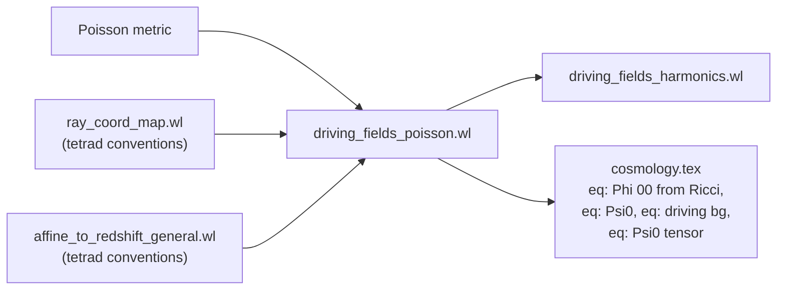

# 04 — `driving_fields_poisson.wl`

> Evaluate the two Sachs optical scalars — $\Phi_{00}$ (Ricci focusing)
> and $\Psi_0$ (Weyl shear) — on the Poisson-gauge perturbed FLRW
> metric to first order, decompose by scalar/vector/tensor sector,
> impose TT-gauge, and prove tetrad-convention independence.

## 1. Purpose and paper anchor

Script: [`scripts/driving_fields_poisson.wl`](../driving_fields_poisson.wl)
(499 lines — the heavyweight of the pipeline). Paper anchor:
`sections/code_availability.tex` L28–L32 and the subsection
*"Driving Fields on the Poisson Metric"* of `sections/cosmology.tex`.

Produces the equations labelled
`eq: Phi 00 from Ricci`, `eq: Psi0`, `eq: driving bg`, through
`eq: Psi0 tensor` in the paper — i.e., the full first-order forms of
the two driving fields plus their sector splits.

## 2. First principles


$$
\boxed{\;\Phi_{00} = \tfrac{1}{2}\,R_{\mu\nu}\,k^\mu k^\nu\;}\qquad
\boxed{\;\Psi_0 = -\,R_{abcd}\,k^a Z^b k^c Z^d\;}
$$

These are the two **Sachs optical scalars**, the inhomogeneous drivers
of the geodesic deviation / Jacobi equation for a null congruence:

- $\Phi_{00}$ is the trace-part tidal source — it **focuses** the beam
  (convergence / magnification).
- $\Psi_0$ is the trace-free spin-2 tidal source — it **shears** the
  beam (image distortion).

The complex screen vector
$Z^\mu \equiv (X^\mu + iY^\mu)/\sqrt 2$ combines the two real screen
legs into a spin-$(+2)$ carrier: $\Psi_0$ inherits this spin weight from
the two $Z$ factors in its definition.

**Background values are asymmetric.** By Einstein's equations applied to
a perfect-fluid FLRW, the Ricci projection gives
$R_{\mu\nu}k^\mu k^\nu = 8\pi G(\rho+p)E^2$ (the $p\,g_{\mu\nu}$ piece
drops by $k\cdot k = 0$). Hence

$$
\Phi_{00}^{(0)} = 4\pi G(\rho+p)\,E^2,\qquad
\frac{a^2}{E^2}\,\Phi_{00}^{(0)} = \mathcal H^2 - \mathcal H',
$$

using $\mathcal H^2 = (8\pi G/3)\rho a^2$ and $\mathcal H' = -(4\pi G/3)(\rho+3p)a^2$.
So the Ricci focusing scalar is nonzero at background: it encodes the
average matter/energy distribution along the ray (the paper's
`%%BG_PHI00%%` block prints it as a function of $H(\tau)$ and $H'(\tau)$).

In contrast $\Psi_0^{(0)} = 0$. Two ways to see it: (i) FLRW is
conformally flat, so the Weyl tensor vanishes identically; (ii) even in
the script's Riemann-based definition, every Ricci-trace and
scalar-curvature contribution to $R_{abcd}k^a Z^b k^c Z^d$ vanishes by
the three null identities $k\cdot k = Z\cdot Z = k\cdot Z = 0$, leaving
only the Weyl piece.

> **Note on why first-order $Z$ corrections matter in the code.** The
> final answer $\Psi_0^{(1)} = -C^{(1)}_{abcd}k^a_{(0)}Z^b_{(0)}k^c_{(0)}Z^d_{(0)}$
> only needs *background* $Z^{(0)}$ (Weyl is already trace-free). The
> script, however, evaluates the Riemann form $-R_{abcd}k^a Z^b k^c Z^d$,
> which relies on the null identities holding in the *full* metric to
> kill the Ricci-trace pieces. Background $Z^{(0)}$ is not null in the
> full metric at first order (since $g^{(1)}(Z_{(0)},Z_{(0)})\neq 0$),
> so the first-order corrections to $Z$ are what let the Ricci-trace
> contamination cancel. Phase 13 Test (b) is the numerical sanity check:
> swapping $Z$ back to its background form leaves a nonzero residual. A
> Weyl-based implementation could use $Z^{(0)}$ everywhere and obtain the
> same result; the script picks the Riemann route for code simplicity.


## 3. Pre-assumptions and conventions

| Assumption | Value |
|---|---|
| Metric | Poisson gauge (same as all scripts) |
| Photon direction | fixed along $+x^3$ (standard alignment for the driving-field computation) |
| Perturbation order | $\mathcal O(\varepsilon^1)$ |
| Rescaling | outputs multiplied by the algebraic factor $a^2/E_{\text{obs}}^2$ (L165–168), giving the dimensionless combinations $(a^2/E_{\text{obs}}^2)\Phi_{00}$, $(a^2/E_{\text{obs}}^2)\Psi_0$ that the paper displays. $E_{\text{obs}}$ is kept as a free symbol at every order; no substitution $E_{\text{obs}} \to E_0/a$ is made (that identity is background-only). |
| Hubble rewrite | `a'[tt] -> a[tt] H[tt]`, `a''[tt] -> a[tt](H'[tt] + H[tt]²)` (conformal Hubble $\mathcal H$, written `H[tt]` locally) |
| TT gauge (tensor sector) | $h^i{}_i = 0$ plus transverse constraints applied via `traceRule` |

## 4. Logical derivation chain

### Step A — Metric, Christoffels, Riemann, Ricci

Phase 1–6 (L26–90): build the Poisson metric, its inverse, the
Christoffels, the Riemann tensor (both index-up form `RiemUp`^{α}_{βγδ}
and fully-lowered `RiemDown`_{αβγδ}), and the Ricci tensor
`Ricci`_{μν}, all linearised in $\varepsilon$.

- Christoffels: $\Gamma^\alpha_{\mu\nu} = \tfrac{1}{2}g^{\alpha\beta}(\partial_\mu g_{\beta\nu} + \partial_\nu g_{\beta\mu} - \partial_\beta g_{\mu\nu})$.
- Riemann: $R^\rho{}_{\sigma\mu\nu} = \partial_\mu\Gamma^\rho_{\nu\sigma} - \partial_\nu\Gamma^\rho_{\mu\sigma} + \Gamma^\rho_{\mu\lambda}\Gamma^\lambda_{\nu\sigma} - \Gamma^\rho_{\nu\lambda}\Gamma^\lambda_{\mu\sigma}$.
- Ricci: $R_{\mu\nu} = R^\rho{}_{\mu\rho\nu}$.

### Step B — Tetrad (observer, line-of-sight, screen)

Phase 7 (L92–134):

$$
u^\mu = a^{-1}(1+2\varepsilon\Psi)^{-1/2}\,\delta^\mu_0, \qquad
e_{(i)}^\mu = a^{-1}\bigl(-\varepsilon\partial_i B,\;\delta^i{}_j + \varepsilon(\Phi\delta^i{}_j - \tfrac{1}{2}h^i{}_j)\bigr),
$$

with $e_{(3)}^\mu$ the line-of-sight and $\{e_{(1)},e_{(2)}\} = \{X,Y\}$
the screen legs. The complex screen pair is

$$
Z^\mu = (X^\mu + iY^\mu)/\sqrt 2,\qquad \bar Z^\mu = (X^\mu - iY^\mu)/\sqrt 2,
$$

with the standard $Z\cdot Z = 0$, $Z\cdot\bar Z = 1$. A long block of
orthonormality assertions (L117–134) verifies every relation to
$\mathcal O(\varepsilon)$.

### Step C — Evaluate $\Phi_{00}$ and $\Psi_0$

Phase 8 (L136–151). Direct contraction:

$$
\Phi_{00} = \tfrac{1}{2}\sum_{\mu\nu}R_{\mu\nu}\,k^\mu k^\nu,\qquad
\Psi_0 = -\sum_{abcd}R_{abcd}\,k^a Z^b k^c Z^d.
$$

`Coefficient[·, eps, 1]` isolates the first-order pieces
`phi00Lin`, `psi0Lin`.

### Step D — Hubble substitutions and rescaling

Phase 9 (L153–168). Replace all $a'$, $a''$ with conformal Hubble
symbols, then rescale:

$$
(a^2/E^2)\,\Phi_{00}^{(1)} \equiv \text{phi00CoLin},\qquad
(a^2/E^2)\,\Psi_0^{(1)} \equiv \text{psi0CoLin}.
$$

This dimensionless form is what the paper displays.

### Step E — Sector decomposition

Phase 11 (L196–238). `zeroField[f]` kills a function symbol *and all its
derivatives* by pattern-matching `Derivative[__][f][__]` and `f[__]`.
Applying to composite field lists isolates:

- `phi00ScalarLin`, `psi0ScalarLin` — only $\Psi,\Phi$ nonzero.
- `phi00TensorLin`, `psi0TensorLin` — only $h_{ij}$ nonzero.
- `phi00BLin`, `psi0BLin` — only $B$ nonzero.

### Step F — TT gauge on the tensor sector

Phase 12 (L240–278). The transverse-traceless constraints

$$
h^i{}_i = 0,\qquad \partial^i h_{ij} = 0
$$

are imposed by a **function-level substitution rule**:

```
traceRule = hF33 -> Function[{t, X1, X2, X3},
                              - hF11[t,X1,X2,X3] - hF22[t,X1,X2,X3]]
```

This propagates through every derivative of `hF33` automatically,
yielding `phi00CoLinTT`, `psi0CoLinTT`, `phi00TensorTT`, `psi0TensorTT`.
(The transversality constraints themselves do not further reduce the
output at this stage — they are used downstream in script 5.)

### Step G — Rotation invariance of $\Psi_0^{(1)}$ (Phase 13, L280–403)

The **key rigor check**. Claim: any two first-order-orthonormal screen
bases yield the same $\Psi_0^{(1)}$.

Physical argument: a rotation in the screen plane,
$X' = X + \varepsilon\omega Y$, $Y' = Y - \varepsilon\omega X$ with
$\omega(\tau,\mathbf x)$ arbitrary, takes $Z \to Z\,e^{-i\varepsilon\omega}$
and therefore $\Psi_0 \to e^{-2i\varepsilon\omega}\Psi_0$. To
$\mathcal O(\varepsilon^1)$ the shift is $-2i\varepsilon\omega\,\Psi_0^{(0)}$,
which vanishes because $\Psi_0^{(0)} = 0$ on the conformally flat FLRW
background.

- **Test (a) — positive control.** Build rotated `XsRot`, `YsRot`,
  `ZsRot` with an arbitrary `omegaF[τ,x1,x2,x3]`; recompute $\Psi_0$
  with the rotated basis; assert
  `Simplify[psi0Lin - psi0RotLin] === 0`. **PASS** confirms that any
  two first-order orthonormal bases agree.
- **Test (b) — negative control.** Use the *background* screen basis
  (which fails first-order orthonormality by $-2\varepsilon\Phi + \varepsilon h_{xx}$,
  etc.). The residual is nonzero — as it must be. This proves that
  test (a)'s invariance is a property of *properly normalised* tetrads,
  not a universal cancellation.
- **Test (c) — negative control, $\Phi_{00}$ side.** Replace $k^\mu$ by
  $k^\mu_{(0)}$ inside $\Phi_{00}$; the residual is nonzero because the
  FLRW background Ricci is nonzero (unlike background Weyl). This is
  why script 4 always keeps $k^\mu$ to $\mathcal O(\varepsilon)$ inside
  $\Phi_{00}$.

### Step H — Flat-triad vs. full-tetrad spatial projection (Phase 14, L405–497)

The paper defines the spin-2 projection of $h_{ij}$ via the *flat*
background screen triad $m_{(0)}^i = x^i_{(0)} + i y^i_{(0)}$ (no factor
of $1/a$). An alternative convention would use the spatial part of the
full 4-vector tetrad $Z^\mu$, which carries a leading $1/a$. Because
$h_{ij}$ is itself $\mathcal O(\varepsilon)$, $\mathcal O(\varepsilon)$
corrections to the triad contribute only at $\mathcal O(\varepsilon^2)$,
so the two conventions differ only by a factor:

$$
{}_2 h^{\mathrm{full}} = \frac{1}{2a^2}\,{}_2 h^{\mathrm{flat}} + \mathcal O(\varepsilon^2).
$$

The factor $1/2$ is the $1/\sqrt 2$ in $Z = (X+iY)/\sqrt 2$ squared; the
$1/a^2$ is the spatial-tetrad $1/a$ squared. Phase 14 verifies this
identity symbolically and confirms that the paper's prefactor
$E^2/(4 a^2)$ carries the *complete* $a$-dependence with no hidden
factors left over. Test passes if `residual === 0` at L465.

## 5. Code map

| Phase | Lines | Action |
|-------|-------|--------|
| 1 | 26–41 | Coordinates, perturbation fields |
| 2 | 43–54 | Poisson metric |
| 3 | 58–62 | Inverse metric `gMinv` |
| 4 | 64–72 | Christoffels `Gam` |
| 5 | 74–85 | Riemann `RiemUp`, `RiemDown` |
| 6 | 87–90 | Ricci `Ricci` |
| 7 | 92–134 | Tetrad $(u,e_{(i)},Z)$; $k^\mu$; orthonormality & null checks |
| 8 | 136–151 | $\Phi_{00}$ and $\Psi_0$ via direct contraction; split `BG`/`Lin` |
| 9 | 153–168 | Hubble substitutions; rescale by $a^2/E_{\text{obs}}^2$ |
| 10 | 170–194 | Emit `%%BG_*%%`, `%%LIN_*%%`, `%%LIN_*_INPUT%%` |
| 11 | 196–238 | Scalar / Tensor / B sector splits via `zeroAll[…]` |
| 12 | 240–278 | TT gauge via `traceRule`; emit `%%TENSOR_*_TT%%` |
| 13 | 280–403 | Rotation-invariance of $\Psi_0^{(1)}$ + negative controls |
| 14 | 405–497 | Flat-triad vs. full-tetrad spatial projection consistency |

## 6. Inputs / outputs

**Inputs:** perturbation field symbols; `a[tt]`; Hubble symbol `H[tt]`.

**TeX markers → paper:**

| Marker | Content | Paper label |
|---|---|---|
| `%%BG_PHI00%%` | $(a^2/E^2)\Phi_{00}$ at background | `eq: driving bg` |
| `%%LIN_PHI00%%` | $(a^2/E^2)\Phi_{00}^{(1)}$ | `eq: Phi 00 from Ricci` |
| `%%BG_PSI0%%` | $(a^2/E^2)\Psi_0$ at background | `eq: driving bg` |
| `%%LIN_PSI0%%` | $(a^2/E^2)\Psi_0^{(1)}$ | `eq: Psi0` |
| `%%SCALAR_PHI00_LIN%%`, `%%SCALAR_PSI0_LIN%%` | scalar sector | `eq: Phi00 scalar`, `eq: Psi0 scalar` |
| `%%TENSOR_PHI00_LIN%%`, `%%TENSOR_PSI0_LIN%%` | tensor sector (pre-TT) | — |
| `%%TENSOR_PHI00_TT%%`, `%%TENSOR_PSI0_TT%%` | tensor sector, TT gauge applied | `eq: Phi00 tensor`, `eq: Psi0 tensor` |
| `%%B_PHI00_LIN%%`, `%%B_PSI0_LIN%%` | $B$ sector | — |
| `%%LIN_PHI00_INPUT%%`, `%%LIN_PSI0_INPUT%%` | full expressions in `InputForm` | (re-ingestable) |

No `.m` file — the next script (`driving_fields_harmonics.wl`) takes
these expressions as its *physical* input (they are already written
into the code, not piped via serialization).

## 7. Built-in verification (summary)

| Check | Phase | Expected |
|---|---|---|
| Tetrad orthonormality $(u\cdot u, e\cdot e, e\cdot u, X\cdot X, Y\cdot Y, X\cdot Y, X\cdot e, Y\cdot e, X\cdot u, Z\cdot Z, Z\cdot\bar Z)$ | 7 | $-1, 1, 0, 1, 1, 0, 0, 0, 0, 0, 1$ |
| $k\cdot k$, $k\cdot u$, $k\cdot Z$ | 7 | $0, E_{\text{obs}}, 0$ |
| $\Psi_0^{(1)}$ rotation invariance | 13a | residual $\equiv 0$ (PASS) |
| BG-basis $\Psi_0^{(1)}$ residual | 13b | nonzero (CONSISTENT) |
| $\Phi_{00}^{(1)}$ bg-$k$ residual | 13c | nonzero (CONSISTENT — bg Ricci ≠ 0) |
| Flat vs. full triad factor | 14 | `h2Full - h2Flat/(2 a²) === 0` (PASS) |

## 8. How to reproduce

```bash
# ~5 minutes on a modern laptop because of the Riemann build
wolframscript -file scripts/driving_fields_poisson.wl
```

The skill wrapper
`~/.claude/skills/mathematica-xact-xpand/scripts/run-wl.sh scripts/driving_fields_poisson.wl 600`
increases timeout to 600 s if needed.

## 9. Upstream / downstream



<details><summary>Mermaid source</summary>



</details>

- **Upstream:** Poisson metric; tetrad/photon conventions shared with
  scripts 1–2.
- **Downstream:** `driving_fields_harmonics.wl` takes the physical
  expressions from the `%%SCALAR_*%%`, `%%TENSOR_*_TT%%`, `%%B_*%%`
  blocks and projects them onto $Y_{\ell m}$ / ${}_2 Y_{\ell m}$.
