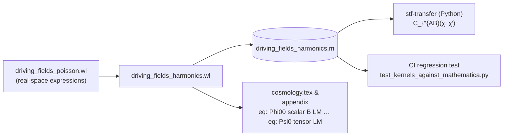

# 05 — `driving_fields_harmonics.wl`

> Project the real-space driving fields $\Phi_{00}$ and $\Psi_0$ onto
> spherical harmonics, reduce 3D spatial derivatives to radial
> operators + $\ell$-eigenvalues, and emit the per-$\ell$ transfer
> operators $T^{\Phi_{00}}_{X,\ell}$, $T^{\Psi_0}_{X,\ell}$ as
> six-element coefficient vectors. The serialized result is the
> single symbolic source of truth for the Python pipeline.

## 1. Purpose and paper anchor

Script: [`scripts/driving_fields_harmonics.wl`](../driving_fields_harmonics.wl)
(426 lines). Paper anchor:
`sections/code_availability.tex` L33–L38. Feeds the equations labelled
`eq: Phi00 scalar B LM` through `eq: Psi0 tensor LM` in
`sections/cosmology.tex`, plus the harmonic appendix.

Deliverable: a Mathematica association written to
[`scripts/driving_fields_harmonics.m`](../driving_fields_harmonics.m)
containing, for each source field
$X \in \{\Psi,\Phi,B,h^{(0)},h^{(1)},h^{(2)}\}$, a 6-element coefficient
vector expressing the driving-field multipole as a linear combination of
$\{X_{\ell m},\,\partial_\chi X_{\ell m},\,\partial_\chi^2 X_{\ell m},\,\partial_\tau X_{\ell m},\,\partial_\tau^2 X_{\ell m},\,\partial_\tau\partial_\chi X_{\ell m}\}$.

## 2. First principles

- **Expansion of a scalar on each shell.** Any scalar field on a
  past-light-cone shell of radius $\chi$ expands as
  $f(\tau,\chi\hat n) = \sum_{\ell m} f_{\ell m}(\tau,\chi)\,Y_{\ell m}(\hat n)$.
  Likewise a spin-$s$ field expands in ${}_s Y_{\ell m}$.
- **Radial/angular decomposition of $\partial_i$.** With
  $x^i = \chi\,\hat n^i$,
  $$
  \partial_i = \hat n_i\,\partial_\chi + \frac{1}{\chi}\,\nabla_i^{(S)},
  $$
  where $\nabla_i^{(S)}$ is the covariant derivative on the unit sphere.
- **Eigenvalues of $\nabla^2_{(S)}$.** On $Y_{\ell m}$ it acts as
  $-\ell(\ell+1)$. With $L_2 := \ell(\ell+1)$,
  $$
  \nabla^2 f_{\ell m} = \bigl[\partial_\chi^2 + \tfrac{2}{\chi}\partial_\chi - \tfrac{L_2}{\chi^2}\bigr]f_{\ell m}.
  $$
- **Spin-raising operator $\eth$** (Newman–Penrose / Goldberg et al.).
  For a complex screen vector $m^i$,
  $m^i\partial_i f = (1/\chi)\,\eth f$. On spin-$s$ harmonics,
  $$
  \eth\,{}_s Y_{\ell m} = +\sqrt{(\ell-s)(\ell+s+1)}\,{}_{s+1}Y_{\ell m}.
  $$
  For $s = 0 \to 2$ the iterated coefficient is $\sqrt{L_2(L_2-2)}$.
  (Verified numerically in `/tmp/verify_spin_raise.wl` during
  development; see L290 in the script.)

## 3. Pre-assumptions and conventions

| Assumption | Value |
|---|---|
| Input expressions | real-space first-order $\Phi_{00}$, $\Psi_0$ (scalar, $B$, tensor sectors) — **hand-transcribed from the `%%…%%` blocks of script 4** so script 5 stays self-contained |
| Operator replacement rules | embedded as Mathematica functions (`dchi`, `dtt`, `LaplaceFull`, `nini`, `nPerp`, `nPar`, `Dnull`, `Dnull2`, `spinRaise2`) |
| Conformal Hubble | symbol `Hconf[tt]` plus `Hconf'[tt]` |
| Complex null screen 3-vector | $\hat{\screenvec}^i = (\hat{\mathbf x}^i + \mathrm i\,\hat{\mathbf y}^i)/\sqrt{2}$ (**NP-normalised**, matching the paper; $\delta_{ij}\hat{\screenvec}^i\bar{\hat{\screenvec}}^j = 1$) |
| Tensor decomposition | $h_{nn}\to h^{(0)}_{\ell m}\,Y_{\ell m}$, $h_{mn}\to h^{(1)}_{\ell m}\,{}_1 Y_{\ell m}$, $h_{mm}\to h^{(2)}_{\ell m}\,{}_2 Y_{\ell m}$ with $h_{mm} \equiv \hat{\screenvec}^i\hat{\screenvec}^j h_{ij} = h_+ + \mathrm i\,h_\times$ |
| Spin-2 eigenvalue | $\sqrt{L_2(L_2-2)}/(2\chi^2)$ (NP-normalised $m$); intermediate raise spin-1 gets $\sqrt{L_2-2}/(\chi\sqrt{2})$ |
| E/B conversion | symbolic factors `A0E`, `A1E`, `A1B` — left as placeholders to be fixed by the appendix's TT tables |
| Derivative basis | $\{X,\partial_\chi X,\partial_\chi^2 X,\partial_\tau X,\partial_\tau^2 X,\partial_\tau\partial_\chi X\}$ (6 terms) |

## 4. Logical derivation chain

### Step A — Define operator primitives

Phase "Helpers" (L53–72). Each physical 3D operator becomes a *symbolic
function on a radial multipole* `f[tt, chi]`:

| Operator | Implementation |
|---|---|
| $\partial_\chi$ | `dchi[f] := D[f, chi]` |
| $\partial_\tau$ | `dtt[f] := D[f, tt]` |
| $n^i\partial_i$ (radial) | `nPar[f] := dchi[f]` |
| $n^i n^j\partial_i\partial_j$ | `nini[f] := dchi2[f]` |
| $\nabla^2$ | `LaplaceFull[f] := dchi2[f] + 2/chi dchi[f] - L2/chi² f` |
| $\nabla_\perp^2$ | `nPerp[f] := 2/chi dchi[f] - L2/chi² f` |
| $\mathcal D = \partial_\tau - \partial_\chi$ | `Dnull[f]` |
| $\mathcal D^2$ | `Dnull2[f]` |
| $m^i m^j \partial_i\partial_j$ (spin-raise twice, NP-normalised $m$) | `spinRaise2[f] := Sqrt[L2(L2-2)]/(2 chi²) f` |

### Step B — Scalar sector multipoles

Phase "Per-multipole driving fields" (L84–112). Take the real-space
expressions from script 4 and replace each differential operator by its
multipole form:

$$
\frac{a^2}{E^2}\,\Phi_{00,\ell m}^{(1,s)} = \Bigl[2(\mathcal H' - \mathcal H^2)\,\Psi + \mathcal H(\dot\Psi - \dot\Phi) - 2\mathcal H\,\partial_\chi\Psi + \tfrac{1}{2}\nabla_\perp^2(\Phi+\Psi) + \mathcal D^2\Phi\Bigr]_{\ell m},
$$

$$
\frac{a^2}{E^2}\,\Psi_{0,\ell m}^{(1,s)} = -\tfrac{1}{2}\,\frac{\sqrt{L_2(L_2-2)}}{\chi^2}\,(\Phi+\Psi)_{\ell m},
$$

and the analogous $B$-sector forms
(`Phi00BLM`, `Psi0BLM` at L106–112).

### Step C — Extract transfer-operator vectors

Phase "Collect as operator-form transfer functions" (L140–184).
`opMatrix[expr, basis]` is a one-line workhorse:

```mathematica
basisFor[f_] := {f, dchi[f], dchi2[f], dtt[f], dtt2[f], dttchi[f]};
opMatrix[expr_, basis_] := Table[Coefficient[Expand[expr], b], {b, basis}];
```

It pulls out the coefficients of each derivative-basis element, giving,
for example,

```
coefPhi00ScalarPhi = {-L2/(2 chi^2), 1/chi, 1, -Hconf[tt], 1, -2}
```

which translates to

$$
(a^2/E^2)\Phi_{00,\ell m}^{(1,\Phi)} =
-\tfrac{L_2}{2\chi^2}\Phi_{\ell m}
+\tfrac{1}{\chi}\partial_\chi\Phi_{\ell m}
+\partial_\chi^2\Phi_{\ell m}
-\mathcal H\,\partial_\tau\Phi_{\ell m}
+\partial_\tau^2\Phi_{\ell m}
-2\,\partial_\tau\partial_\chi\Phi_{\ell m}.
$$

The same routine is run on every $\{$observable, source$\}$ pair,
generating the six scalar/$B$ coefficient vectors
`coefPhi00ScalarPsi`, `coefPhi00ScalarPhi`, `coefPsi0ScalarPsi`,
`coefPsi0ScalarPhi`, `coefPhi00BB`, `coefPsi0BB`.

### Step D — Tensor sector

Phase "Tensor sector of Phi_00 and Psi_0" (L258–326). The TT tensor
$h_{ij}$ projects onto *three* spin components along a given sightline:

$$
h_{nn} = \sum h^{(0)}_{\ell m} Y_{\ell m},\quad
h_{mn} = \sum h^{(1)}_{\ell m}\,{}_1 Y_{\ell m},\quad
h_{mm} = \sum h^{(2)}_{\ell m}\,{}_2 Y_{\ell m}.
$$

Direct substitution into the TT-gauge forms emitted by script 4 gives

$$
\Phi_{00,\ell m}^{(1,t)} = \frac{E^2}{4 a^2}\Bigl[\partial_\tau^2 + 2\mathcal H\partial_\tau + \tfrac{L_2}{\chi^2} - \partial_\chi^2 - \tfrac{2}{\chi}\partial_\chi\Bigr] h^{(0)}_{\ell m},
$$

$$
\Psi_{0,\ell m}^{(1,t)} = \frac{E^2}{4 a^2}\Bigl[\mathcal D^2 h^{(2)}_{\ell m} + 2\mathcal D\!\left(\tfrac{\sqrt{L_2-2}}{\chi} h^{(1)}_{\ell m}\right) + \tfrac{\sqrt{L_2(L_2-2)}}{\chi^2}\,h^{(0)}_{\ell m}\Bigr].
$$

Four more coefficient vectors (`coefPhi00T0`, `coefPsi0T0`,
`coefPsi0T1`, `coefPsi0T2`) are extracted by `opMatrix` on each
$h^{(s)}$ basis.

### Step E — E/B re-expression (optional presentation)

Phase "Re-express the tensor sector in the E/B basis" (L327–407). GW
amplitudes per shell are parity-labelled E/B. Keeping the ell-dependent
conversion factors symbolic,

$$
h^{(2)}_{\ell m} = h^E_{\ell m} + i\,h^B_{\ell m},\quad
h^{(1)}_{\ell m} = \alpha_1^E\,h^E + i\,\alpha_1^B\,h^B,\quad
h^{(0)}_{\ell m} = \alpha_0^E\,h^E,
$$

(with $\alpha_0^E, \alpha_1^E, \alpha_1^B$ fixed by the appendix's TT
tables — left as `A0E[ll, chi]`, `A1E[ll, chi]`, `A1B[ll, chi]`
placeholders in-script), substitutes, expands, and splits into
E-contribution and B-contribution pieces. These are emitted as
`%%TEX_PHI00_TENSOR_EB%%`, `%%TEX_PSI0_TENSOR_E%%`, `%%TEX_PSI0_TENSOR_B%%`.

### Step F — Serialise

Final block (L409–424). `Put[…, "scripts/driving_fields_harmonics.m"]`
writes the association

```mathematica
{
  "Phi00_Psi" -> coefPhi00ScalarPsi,
  "Phi00_Phi" -> coefPhi00ScalarPhi,
  "Phi00_B"   -> coefPhi00BB,
  "Psi0_Psi"  -> coefPsi0ScalarPsi,
  "Psi0_Phi"  -> coefPsi0ScalarPhi,
  "Psi0_B"    -> coefPsi0BB,
  "Phi00_h0"  -> coefPhi00T0,
  "Psi0_h0"   -> coefPsi0T0,
  "Psi0_h1"   -> coefPsi0T1,
  "Psi0_h2"   -> coefPsi0T2,
  "derivBasis"-> derivLabels
}
```

which is the regression fixture for the Python pipeline.

## 5. Code map

| Phase | Lines | Action |
|-------|-------|--------|
| Helpers | 53–72 | Operator primitives `dchi`, `dtt`, `LaplaceFull`, `Dnull`, `spinRaise2`, … |
| Scalar fields | 75–82 | Radial multipoles `psiLM`, `phiLM`, `bLM`; `Hconf[tt]` |
| Scalar sector | 84–112 | Build `Phi00ScalarLM`, `Psi0ScalarLM`, `Phi00BLM`, `Psi0BLM` |
| Emit TeX | 122–136 | `%%TEX_PHI00_SCALAR_LM%%`, … |
| Operator extraction | 138–184 | `opMatrix` on each source; `printOp` human-readable dump |
| Tensor sector | 258–325 | `Phi00TensorLM`, `Psi0TensorLM`; extract `coef*T0/T1/T2` |
| E/B basis | 327–407 | Symbolic E/B decomposition |
| Serialise | 409–424 | Write `.m` file; printed confirmation |

## 6. Inputs / outputs

**Inputs (symbolic, hand-transcribed from script 4):**

- Scalar sector formulae for $\Phi_{00}^{(1,s)}$, $\Psi_0^{(1,s)}$ as
  operator chains on $\Psi, \Phi$.
- $B$-sector formulae.
- TT-gauge tensor-sector formulae.

**TeX output markers → paper:**

| Marker | Content |
|---|---|
| `%%TEX_PHI00_SCALAR_LM%%` / `%%TEX_PSI0_SCALAR_LM%%` | scalar-sector multipoles of $\Phi_{00}$, $\Psi_0$ |
| `%%TEX_PHI00_B_LM%%` / `%%TEX_PSI0_B_LM%%` | $B$-sector multipoles |
| `%%TEX_PHI00_TENSOR_LM%%` / `%%TEX_PSI0_TENSOR_LM%%` | tensor-sector multipoles on $h^{(s)}$ |
| `%%TEX_PHI00_TENSOR_EB%%` / `%%TEX_PSI0_TENSOR_E%%` / `%%TEX_PSI0_TENSOR_B%%` | same, in E/B basis |
| `%%COEF_*%%` | coefficient vectors for each source, in TeX |

**Serialized output:** [`scripts/driving_fields_harmonics.m`](../driving_fields_harmonics.m)
— the 10 transfer-operator vectors plus `derivBasis`. Reading it back is
one line of Mathematica or a `dict(load_mathematica_m(...))` call in
Python.

### Decoded coefficient table

Read from the `.m` dump directly (so readers don't have to run the
script to see the answer):

| Key | Vector — ordered in the derivative basis $\{X,\partial_\chi X,\partial_\chi^2 X,\partial_\tau X,\partial_\tau^2 X,\partial_\tau\partial_\chi X\}$ |
|---|---|
| `Phi00_Psi` | $\bigl(-\tfrac{L_2}{2\chi^2} - 2\mathcal H^2 + 2\mathcal H',\;\tfrac{1}{\chi} - 2\mathcal H,\;0,\;\mathcal H,\;0,\;0\bigr)$ |
| `Phi00_Phi` | $\bigl(-\tfrac{L_2}{2\chi^2},\;\tfrac{1}{\chi},\;1,\;-\mathcal H,\;1,\;-2\bigr)$ |
| `Phi00_B`   | $\bigl(0,\;2\mathcal H^2 - 2\mathcal H',\;\mathcal H,\;\tfrac{L_2}{2\chi^2},\;0,\;-\tfrac{1}{\chi}\bigr)$ |
| `Psi0_Psi`  | $\bigl(-\tfrac{\sqrt{L_2(L_2-2)}}{2\chi^2},\;0,\;0,\;0,\;0,\;0\bigr)$ |
| `Psi0_Phi`  | $\bigl(-\tfrac{\sqrt{L_2(L_2-2)}}{2\chi^2},\;0,\;0,\;0,\;0,\;0\bigr)$ |
| `Psi0_B`    | $\bigl(0,\;0,\;0,\;\tfrac{\sqrt{L_2(L_2-2)}}{2\chi^2},\;0,\;0\bigr)$ |
| `Phi00_h0`  | $\bigl(\tfrac{L_2}{4\chi^2},\;-\tfrac{1}{2\chi},\;-\tfrac{1}{4},\;\tfrac{\mathcal H}{2},\;\tfrac{1}{4},\;0\bigr)$ |
| `Psi0_h0`   | $\bigl(\tfrac{\sqrt{L_2(L_2-2)}}{4\chi^2},\;0,\;0,\;0,\;0,\;0\bigr)$ |
| `Psi0_h1`   | $\bigl(\tfrac{\sqrt{L_2-2}}{\sqrt{2}\chi^2},\;-\tfrac{\sqrt{L_2-2}}{\sqrt{2}\chi},\;0,\;\tfrac{\sqrt{L_2-2}}{\sqrt{2}\chi},\;0,\;0\bigr)$ |
| `Psi0_h2`   | $\bigl(0,\;0,\;\tfrac{1}{2},\;0,\;\tfrac{1}{2},\;-1\bigr)$ |

## 7. Built-in verification

The script prints each transfer vector in readable operator form via
`printOp[…]` so a human can eyeball each entry against the real-space
expressions from script 4. The physical checks (spin-raising eigenvalue,
E/B factor identities) are:

- Goldberg spin-raising identity $\sqrt{(\ell-s)(\ell+s+1)}$ (cited
  L286–290 and cross-checked numerically in `/tmp/verify_spin_raise.wl`
  during development).
- The E/B conversion leaves $\Phi_{00}$ with only an E-contribution
  (parity argument: a spin-0 observable cannot couple to a parity-odd
  $B$ tensor mode). The script asserts this by structure: `psi0TensorE`
  is computed by setting $h_B \to 0$, and the residual `psi0TensorB`
  is split out explicitly (L384–387).

The ultimate external verification is **CI regression** in the
[`stf-transfer`](https://github.com/…) Python package: the file
[`tests/test_kernels_against_mathematica.py`](https://github.com/…/tests/test_kernels_against_mathematica.py)
loads `driving_fields_harmonics.m` and asserts equality of the
coefficient vectors with the Python-side symbolic reconstruction.

## 8. How to reproduce

```bash
wolframscript -file scripts/driving_fields_harmonics.wl
```

Run time is a few seconds. The `.m` file is overwritten.

## 9. Upstream / downstream



<details><summary>Mermaid source</summary>



</details>

- **Upstream:** real-space $\Phi_{00}$, $\Psi_0$ from
  `driving_fields_poisson.wl`. The transcribed operator forms in
  `Phi00ScalarLM` etc. must stay in sync with the `%%LIN_*%%` /
  `%%TENSOR_*_TT%%` blocks of that script.
- **Downstream:** the `.m` file is the **single symbolic source of
  truth** (per `code_availability.tex` L48–L51). Any downstream
  numerical pipeline that computes driving-field power spectra loads
  this file.
