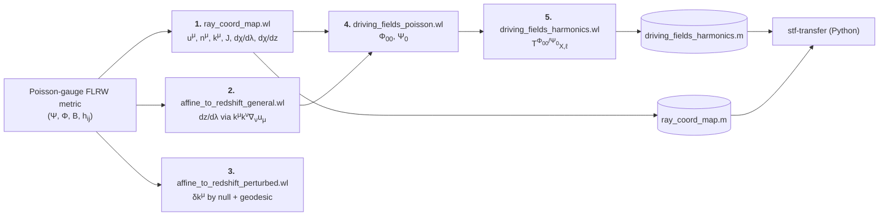

# `scripts/` — symbolic derivation pipeline

This folder contains the Mathematica / xAct / xCoba scripts that *derive*
every first-order analytic expression used in the STF-lensing paper. They are
deterministic: re-executing them regenerates the LaTeX blocks that appear
verbatim in `sections/cosmology.tex` and `sections/appendix.tex`, bracketed
by `%%TEX_..._START%%` markers inside each `.wl` file.

## Index

| # | Script | Documentation | Produces |
|---|--------|---------------|----------|
| 1 | [`ray_coord_map.wl`](../ray_coord_map.wl) | [`01_ray_coord_map.md`](./01_ray_coord_map.md) | Tetrad $(u^\mu, n^\mu)$, $k^\mu$, Jacobian $J$, $\mathrm{d}\chi/\mathrm{d}\lambda$, $\mathrm{d}\chi/\mathrm{d}z$, first-order null-geodesic source |
| 2 | [`affine_to_redshift_general.wl`](../affine_to_redshift_general.wl) | [`02_affine_to_redshift_general.md`](./02_affine_to_redshift_general.md) | $\mathrm{d}z/\mathrm{d}\lambda$ master (background + first-order Born) |
| 3 | [`affine_to_redshift_perturbed.wl`](../affine_to_redshift_perturbed.wl) | [`03_affine_to_redshift_perturbed.md`](./03_affine_to_redshift_perturbed.md) | $\delta k^\mu$ along ray, scalar/vector/tensor RHS, Born integrand (beyond-Born) |
| 4 | [`driving_fields_poisson.wl`](../driving_fields_poisson.wl) | [`04_driving_fields_poisson.md`](./04_driving_fields_poisson.md) | $\Phi_{00}$, $\Psi_0$ to $\mathcal O(\varepsilon)$, sector splits, TT-gauge forms, tetrad-invariance proofs |
| 5 | [`driving_fields_harmonics.wl`](../driving_fields_harmonics.wl) | [`05_driving_fields_harmonics.md`](./05_driving_fields_harmonics.md) | Per-$\ell$ transfer operators $T^{\Phi_{00}}_{X,\ell}$, $T^{\Psi_0}_{X,\ell}$; serialized to `driving_fields_harmonics.m` |

Serialized outputs (consumed by the Python companion
[`stf-transfer`](https://github.com/…)):

- [`ray_coord_map.m`](../ray_coord_map.m) — background kinematic quantities plus scalar-sector source components.
- [`driving_fields_harmonics.m`](../driving_fields_harmonics.m) — the authoritative dictionary of transfer-operator coefficient vectors; regression-tested against the Python pipeline in CI.

Start with [`00_pipeline_overview.md`](./00_pipeline_overview.md) for the
physics chain end-to-end before drilling into a single script.

## Dependency graph

Mermaid source (edit here; SVG is regenerated via `npx mmdc`)

## Shared conventions (read this once)

Every script uses the same Poisson-gauge perturbed FLRW metric, with a
single perturbation bookkeeper `eps` carried through every intermediate
expression. Setting `eps = 0` recovers the FLRW background; the coefficient
of `eps^1` is the linear (first-order) result.

$$
\mathrm{d}s^2 = a^2(\tau)\Bigl[
  -(1+2\varepsilon\Psi)\,\mathrm{d}\tau^2
  -2\varepsilon\,(\partial_i B)\,\mathrm{d}\tau\,\mathrm{d}x^i
  +\bigl((1-2\varepsilon\Phi)\delta_{ij} + \varepsilon h_{ij}\bigr)\,\mathrm{d}x^i\mathrm{d}x^j
\Bigr].
$$

- **Signature** $(-,+,+,+)$. Coordinates `{tt, x1, x2, x3}` = $(\tau, x^i)$.
- **Hubble-flow observer** $u^\mu = (1/(a\sqrt{1+2\varepsilon\Psi}),\,\mathbf 0)$.
- **Photon** $k^\mu = E\,(-u^\mu + n^\mu)$, past-directed along $+x^3$ by default.
  The scripts keep $E$ (local energy) as a free symbol — they *never*
  substitute $E = E_0/a$ because that is a derived background relation
  (see `memory/feedback_photon_energy_bookkeeping.md`).
- **Linearisation** is done with `linearize[x] := Normal@Series[x, {eps, 0, 1}]`,
  applied after each nonlinear step so $\mathcal O(\varepsilon^2)$ residuals
  never propagate.

All five scripts are run as
`wolframscript -file scripts/<name>.wl` (see the header block of each `.wl`
file for the wrapper used in CI).
